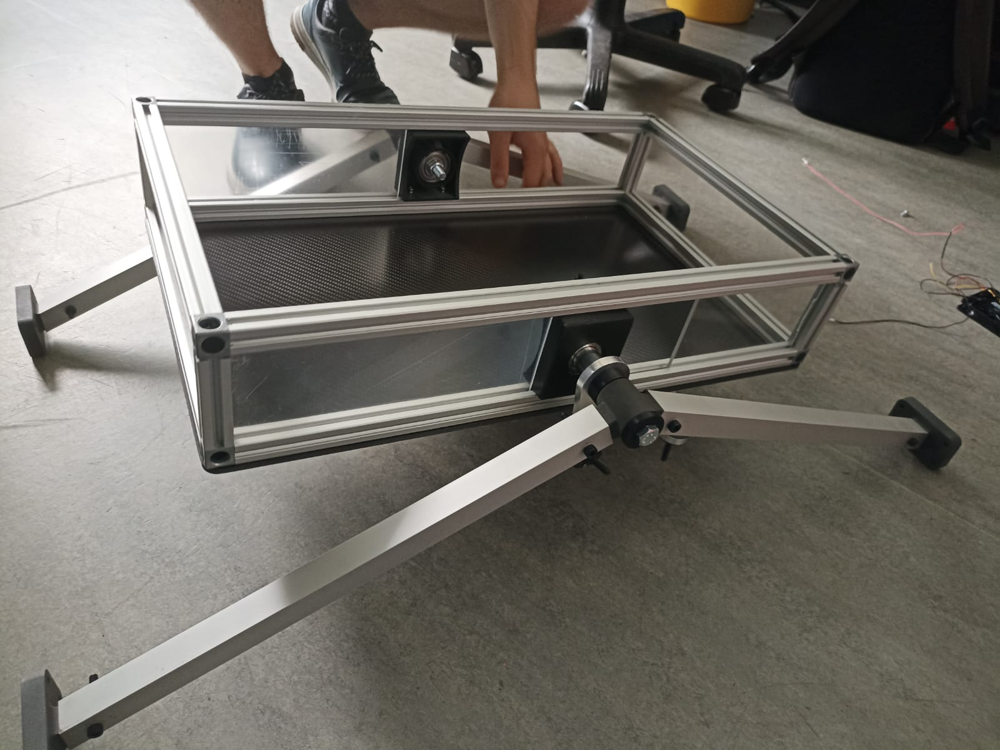
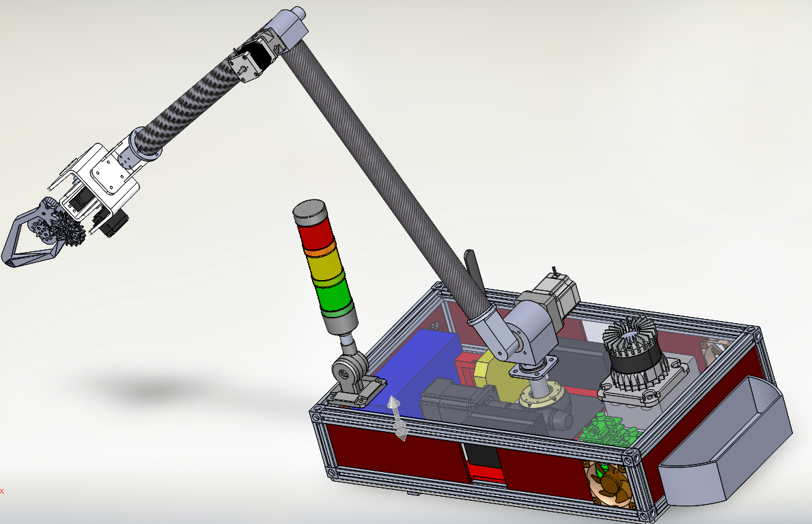

# European Rover Challenge (ERC ’23 & ’24)

**Mechanical Design - Sub-team Lead**  

As part of TU Berlin’s competition team, I worked on the design and development of a planetary rover for the ERC. I was responsible for:

-2023 Event in Kielce, Poland (Mechanical Engineer):

•	Designed the modular chassis body frame in SolidWorks, accounting for internal volume requirements, load paths, and thermal/electrical layout to ensure efficient connection distances and balanced weight distribution.

•	Selected appropriate materials for structural plates and produced manufacturing-ready CAD models.

•	Created the Bill of Materials (BOM) and personally carried out the physical assembly of the rover chassis.

•	Designed the mechanical interface for the robotic arm base, ensuring reliable anchoring and operational accessibility.

•	Served as the primary technician for robotic arm disassembly and reassembly during competition phases.

2024 Event in Krakow, Poland (Sub-team Lead, Chassis Design):
•	Led a small sub team (2 members) to evolve and improve the previous year’s design, focusing on increased modularity for easier maintenance and upgrades.

•	Directed redesign of the chassis to accommodate a larger footprint for improved thermal control and integration of new components such as an upgraded robotic arm and communications tower.

•	Supervised teammates’ CAD modeling and interface design work, coordinating tasks to ensure consistency and assembly feasibility.

🏆 **Result:** Achieved 7th place among 30+ international teams in 2024.

🛠️ **Tools used:** SolidWorks, Ansys Workbench, 3D printing, aluminum profile construction

