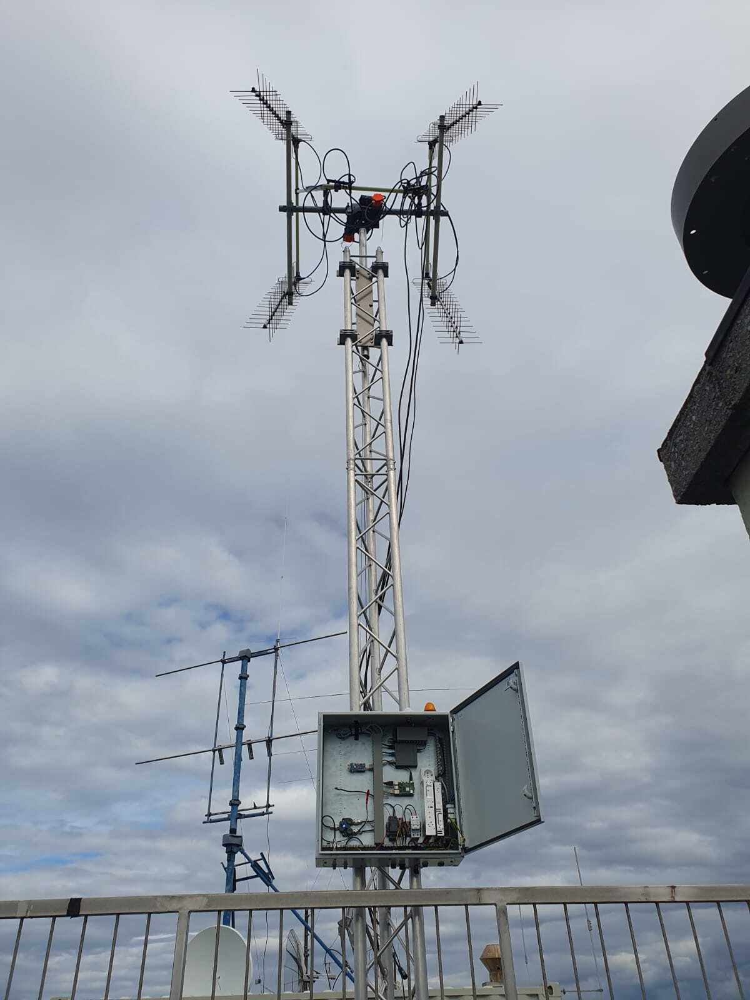

# 📡 BEEGND-4 Ground Station Upgrade (TU Berlin, 2023)

**Role:** Systems Engineer for Mechanical & RF Requirements  
**Location:** Berlin, Germany

---

As part of the student team at TU Berlin, I worked on upgrading the BEEGND-4 ground station to improve satellite communication capability.

---

## 🔧 Responsibilities

- Served as Systems Engineer to integrate mechanical and RF requirements into a unified project plan

- Defined and delegated tasks to ensure timely completion of mechanical design and RF subsystem integration

- Managed the project timeline, coordinating dependencies between pointing accuracy, stability, and RF gain requirements

- Maintained and updated technical documentation to ensure traceability of design choices and compliance with requirements

- Oversaw mechanical assembly and alignment of antenna components to meet system performance criteria

---

## 🎯 Objectives

- Improve mechanical robustness of the ground station and operational reliability
- Enable reliable communication with BEESAT-1 and BEESAT-2 satellites

---

## 🛠️ Tools Used
SolidWorks, RF analysis tools, mechanical prototyping techniques

---

## 📸 Images

---

[🔙 Back to Portfolio Home](index.md)
